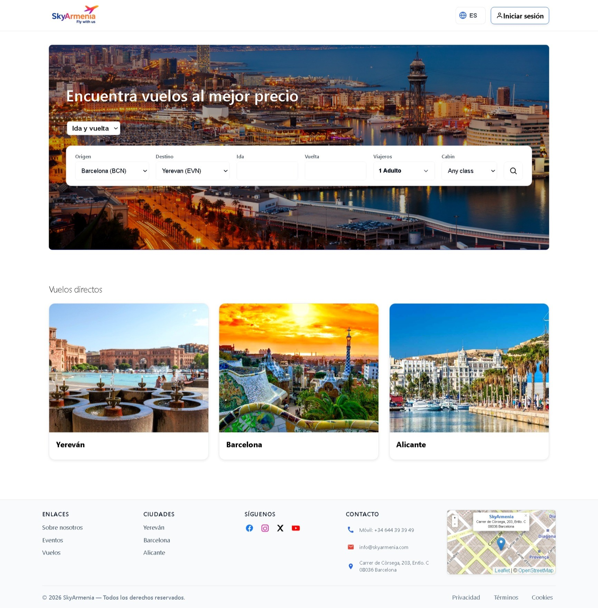

<p align="center">
  
</p>

<h1 align="center">SkyArmenia</h1>

<p align="center">
  <strong>Flight search platform connecting Barcelona, Alicante & Yerevan</strong>
</p>

<p align="center">
  <a href="https://skyarmenia.com">Live Site</a> &middot;
  <a href="#features">Features</a> &middot;
  <a href="#tech-stack">Tech Stack</a> &middot;
  <a href="#getting-started">Getting Started</a>
</p>

---



## Features

- **Real-time flight search** &mdash; Queries the AeroCRS v5 API and returns live availability with pricing
- **Multi-language UI** &mdash; Full support for English, Spanish, Russian, and Armenian
- **Deep-link booking** &mdash; Redirects users to the airline booking engine with the exact flight pre-selected
- **Multi-provider architecture** &mdash; Pluggable provider system ready for additional airlines
- **Responsive design** &mdash; Optimized for desktop, tablet, and mobile
- **Authentication** &mdash; User registration, login, and password reset via Supabase Auth
- **SEO-ready** &mdash; Server-side rendering, dynamic sitemap, and proper meta tags

## Tech Stack

| Layer        | Technology                                                  |
| ------------ | ----------------------------------------------------------- |
| Framework    | [SvelteKit](https://kit.svelte.dev/) with adapter-node      |
| Language     | TypeScript                                                  |
| Database     | [Supabase](https://supabase.com/) (PostgreSQL + Auth)       |
| Flight API   | [AeroCRS v5](https://docs.aerocrs.com/)                     |
| Deployment   | [Render](https://render.com/) (Node 22)                     |
| Maps         | [Leaflet](https://leafletjs.com/) + OpenStreetMap           |
| Date Picker  | [Flatpickr](https://flatpickr.js.org/)                      |

## Architecture

```
src/
├── lib/
│   ├── components/         # Svelte UI components
│   │   ├── Header.svelte
│   │   ├── SearchBar.svelte
│   │   ├── ResultsList.svelte
│   │   ├── Footer.svelte
│   │   └── ...
│   ├── i18n.ts             # Translations (en, es, ru, hy)
│   ├── providers/
│   │   └── types.ts        # Shared provider interfaces
│   └── server/
│       ├── aerocrs-config.ts     # AeroCRS credentials & base URL
│       ├── providers/
│       │   └── aerocrs.ts        # Search + deep-link provider
│       ├── aerocrs/
│       │   └── booking.ts        # 6-step booking pipeline
│       └── supabase.ts           # Supabase client helpers
├── routes/
│   ├── +layout.svelte      # Root layout (auth, i18n)
│   ├── +page.svelte        # Homepage + search results
│   ├── api/
│   │   ├── search/         # GET /api/search
│   │   └── aerocrs/book/   # POST /api/aerocrs/book
│   └── auth/               # Login, register, password reset
└── app.html                # HTML shell
```

## Getting Started

### Prerequisites

- Node.js 20+
- npm

### Installation

```bash
git clone https://github.com/NellyKaykay/SkyArmenia.git
cd SkyArmenia
npm install
```

### Environment Variables

Create a `.env` file at the project root:

```env
AEROCRS_AUTH_ID=your_aerocrs_auth_id
AEROCRS_AUTH_PASSWORD=your_aerocrs_auth_password
AEROCRS_BASE_URL=https://api.aerocrs.com/v5
AEROCRS_ENV=production

PUBLIC_SUPABASE_URL=https://your-project.supabase.co
PUBLIC_SUPABASE_ANON_KEY=your_anon_key
```

### Development

```bash
npm run dev
```

Open [http://localhost:5173](http://localhost:5173).

### Build & Preview

```bash
npm run build
node build
```

## Deployment

The project deploys automatically on **Render** via `render.yaml`.

| Setting       | Value                        |
| ------------- | ---------------------------- |
| Runtime       | Node 22                      |
| Build command | `npm ci && npm run build`    |
| Start command | `node build`                 |
| Adapter       | `@sveltejs/adapter-node`     |

All environment variables are configured in the Render dashboard &mdash; never committed to the repository.

## Routes

| Route              | Description                              |
| ------------------ | ---------------------------------------- |
| `/`                | Homepage with search bar and results     |
| `/auth/register`   | User registration                        |
| `/login`           | User login                               |
| `/forgot`          | Password reset request                   |
| `/privacy`         | Privacy policy                           |
| `/terms`           | Terms of service                         |
| `/api/search`      | Flight search endpoint (GET)             |
| `/api/aerocrs/book`| Booking pipeline endpoint (POST)         |
| `/sitemap.xml`     | Dynamic XML sitemap                      |

## License

All rights reserved. &copy; 2026 SkyArmenia.

## Author

**Nelli Karapetyan** &mdash; [GitHub](https://github.com/NellyKaykay)
